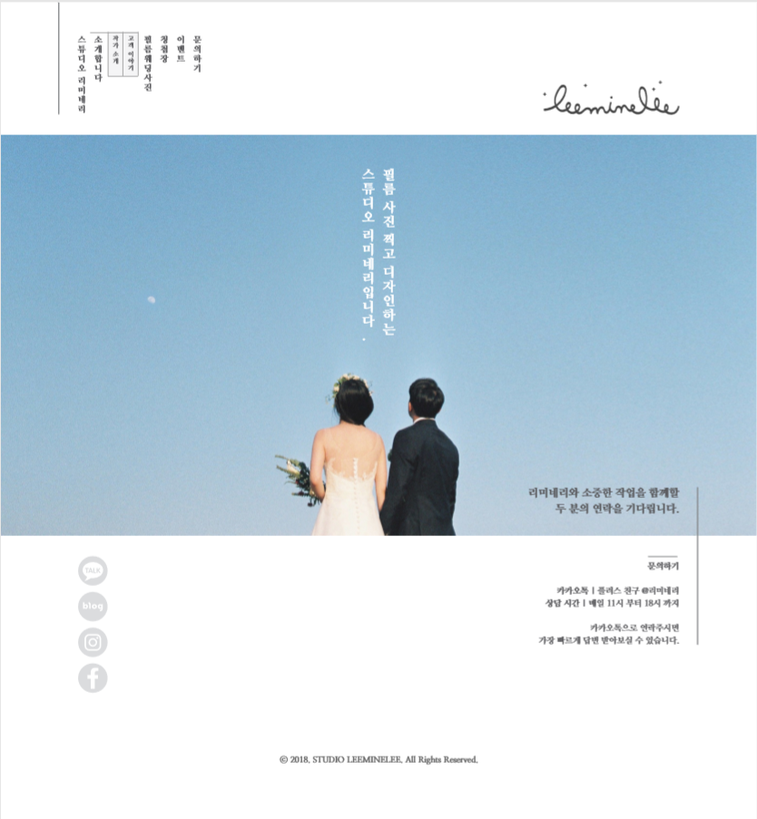
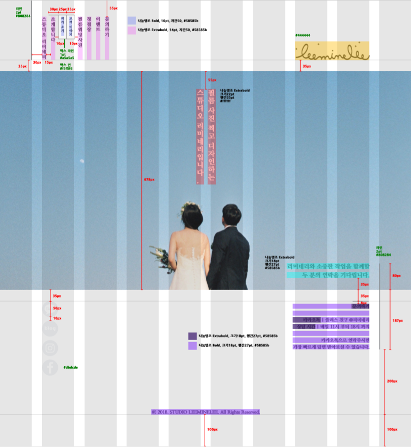

# Wedding Film Studio 'leeminelee' Web Page works
Responsive Web Design, Media Queries applied. Multi devices application.
- Main page
- Photo gallery(필름웨딩사진): Responsive Image Grid
- Sub photo gallery: Modal Image Gallery

Interactive Web Page Design
- jQuery and Vanilla javascript(DOM)

## CSS Styling Major
- Size responsive: use Media query(@media)
- Display: apply Flexbox layout(display: flex)
- Detailed position of elements: Parent element(position: relative), Child element(position: absolute)

## Running the Tests
- Change a size of browser.
- Zoom pages, main and gallery.
- Change devices. If you don't have other devices, can check via Web browser dev tools. For example, in chrome, click the 'Toggle device toolbar' after open Chrome dev tools via shortcuts key, 'ctrl+shift+i'.

click [here](https://ginnyang2.github.io/leeminelee_front/) 

  <b>Design Guide - Index Page Example</b> 
  

  <b>Design Guide - Markup Guide</b> 
  

## References
- Responsive web desing: 모던 웹 사이트 디자인의 정석, EBISUCOM, 위키북스, 2015
- Flex box rayout: 최신 표준 HTML+CSS 디자인, EBISUCOM, 위키북스, 2017
- Markup Guide Standard: 디자이너가 묻고 개발자가 답하는 웹 이야기, 서미연, 유용웅, 펜립, 2017
- jQuery for Interactive Web Design: 인터랙티브 웹디자인북(웹디자이너를 위한 HTML5+CSS3+jQuery 사용설명서), 최성일, 한빛미디어, 2015
- Responsive Image Grid: [W3SCHOOL web page](https://www.w3schools.com/howto/howto_css_image_grid_responsive.asp)
- Modal Image Gallery: [W3SCHOOL web page](https://www.w3schools.com/howto/howto_js_lightbox.asp)

## Copyrights
- Photos and images: [Studio leeminelee](www.leeminelee.com)

### notifications
- gallery.html: 4 column gallery
- gallery_slide.html: 3 column gallery(now using)
- need to fix minor css styles
- low quality images are used for gitHubPages
